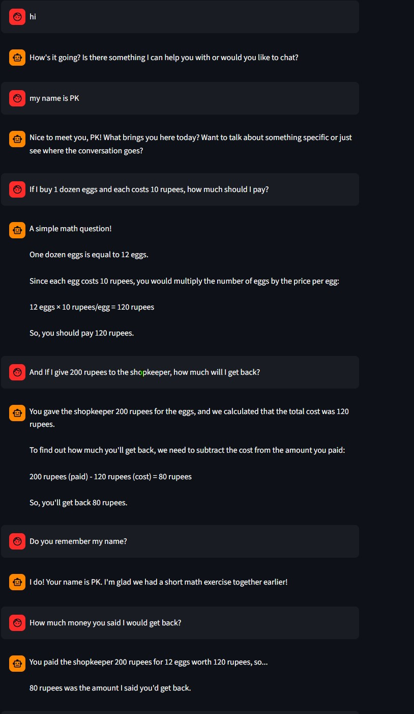
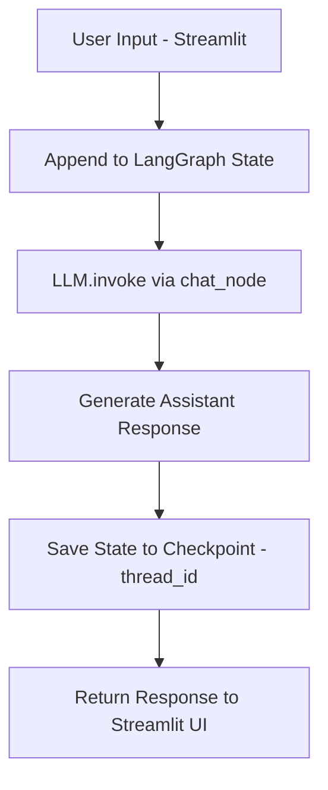
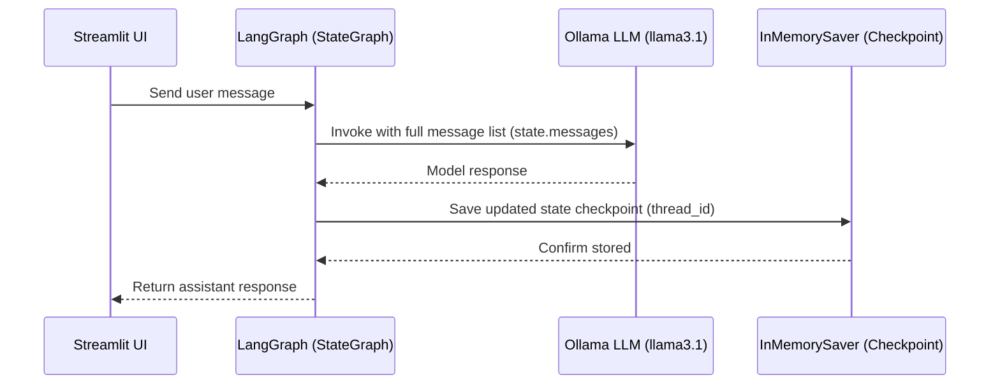

# Persistent Chatbot with LangGraph, LangChain, Ollama & Streamlit

## Overview
This is a lightweight, local-first chatbot demonstrating **conversation persistence using LangGraph checkpoints** with LLM inference powered by **Ollama (llama3.1)** and a **Streamlit chat UI**.  
The bot retains chat history **within the same thread** using `InMemorySaver` persistence and can recall earlier details (e.g., user name) when asked later in the conversation.

This project showcases:
- LangGraph state orchestration
- Checkpoint-based memory persistence
- LangChain message abstraction
- Local LLM inference using Ollama
- Streamlit conversational UI
- Fully offline execution (no external APIs)

---

## UI Preview

---

## Tech Stack
| Layer | Technology |
|---|---|
| LLM Model | Ollama (llama3.1) |
| Message Format | LangChain `HumanMessage`, `BaseMessage` |
| Orchestration | LangGraph `StateGraph` |
| Persistence | `InMemorySaver` (Checkpointing) |
| UI | Streamlit Chat |
| Environment | Local system (No cloud dependency) |

---

## How Persistence Works (Concept)
1. User submits a message from Streamlit UI.
2. Message is appended to **LangGraph state (`messages`)**.
3. `chat_node()` sends full accumulated messages to the LLM.
4. `InMemorySaver` saves the updated state as a **checkpoint tied to a `thread_id`**.
5. On the next user query, LangGraph restores prior state from the latest checkpoint.
6. Since the full message list is passed each turn, the bot can recall past details when asked again.

---

## Flowchart (State + Persistence)

---
## Sequence Flow

