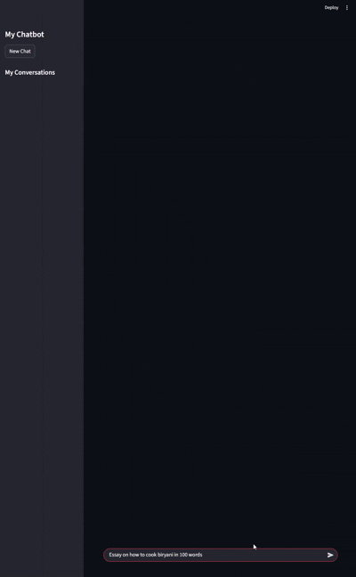
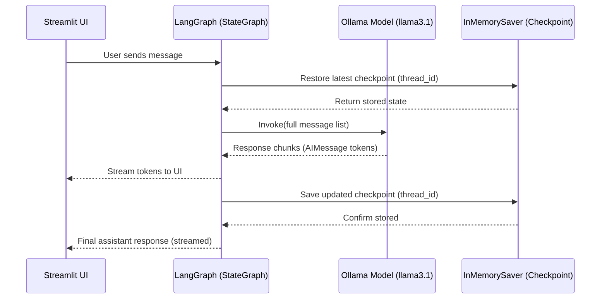

# Streaming & Persistent Local Chatbot

A fully offline chatbot that supports ChatGPT-style **session naming**, **streaming responses**, and **thread-level memory persistence** using **LangGraph checkpoints**. The UI is built in **Streamlit**, orchestration via **LangGraph**, message abstraction via **LangChain**, and inference powered by **Ollama (llama3.1)**.

---

## Features
- **Streaming output** rendered progressively in the chat window (`st.write_stream` + `chatbot.stream`)
- **Thread-level memory** using `InMemorySaver` checkpointer (same thread restores full chat context)
- **ChatGPT-like session titles** (auto-generated via LLM from first user message, UUID stays internal)
- **Multiple chat sessions** accessible from the sidebar
- **No authentication, no cloud APIs, 100% local execution**
- **Name recall within thread** (context is preserved because full message list is replayed each turn)

---

---
## UI Preview

---

## Tech Stack
| Layer | Technology |
|---|---|
| LLM | Ollama `llama3.1` |
| Orchestration | LangGraph `StateGraph` |
| Persistence | `InMemorySaver` (checkpoint per `thread_id`) |
| Messages | LangChain `HumanMessage`, `AIMessage`, `BaseMessage` |
| UI | Streamlit Chat + Sidebar session list |
| Environment | Local/Offline |

---

## How It Works (Persistence + Streaming)
1. A new chat creates a UUID `thread_id` (internal memory key) with **no sidebar entry initially**.
2. When the user sends the **first message**, a short chat title is generated by the LLM and stored in `thread_names`.
3. The user message is appended to `session_state.message_history` and displayed.
4. `chatbot.stream()` sends only `AIMessage` chunks to the UI, which renders tokens progressively.
5. LangGraph stores the full conversation state in an **in-memory checkpoint tied to the thread**.
6. When a sidebar session is selected, the last checkpoint is restored and replayed to the model so recall works.

---
## Sequence Diagram

---
## Sequence Diagram - Sidebar Session Naming Flow (ChatGPT-like UX)
```mermaid
sequenceDiagram
    participant User
    participant Streamlit
    participant LLM

    User->>Streamlit: Click "New Chat"
    Streamlit->>Streamlit: Generate thread_id (UUID)
    Streamlit->>Streamlit: Do NOT show sidebar entry yet

    User->>Streamlit: Send first message
    Streamlit->>LLM: "Create a very short chat title for this message"
    LLM-->>Streamlit: Returns short title
    Streamlit->>Streamlit: Save title in thread_names[thread_id]
    Streamlit->>Streamlit: Now show session in sidebar
