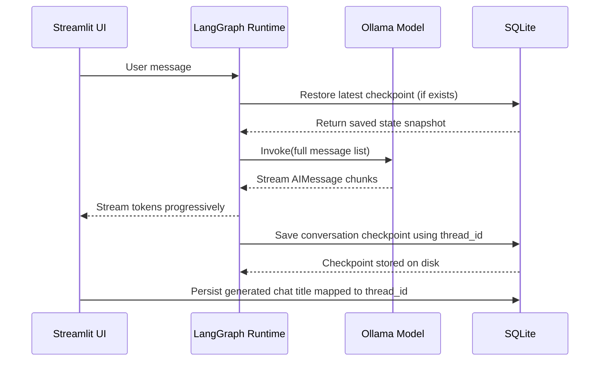

# Streaming & Crash-Resilient Persistent Local Chatbot

## Purpose
This repository captures a **learning-focused, fully offline chatbot** built to demonstrate:

- **Real-time LLM response streaming**
- **Thread-scoped conversational memory**
- **Multi-session conversation switching**
- **ChatGPT-style automatic session naming**
- **Local inference using Ollama (`llama3.1`)**
- **Crash-resilient persistence using SQLite**

---

## Key Highlight (Crash & Restart Resiliency)
**Even after a server or application restart, crash, or unexpected shutdown, the full chat history is restored and visible in the UI.**  
This is possible because **LangGraph checkpoints are persisted to a local SQLite database** using `SqliteSaver`, ensuring conversation state is written to disk, not RAM.

> This is the biggest difference from typical chatbot prototypes that store chat only in memory — here, **history survives restart, crash, or container reboot** and can be loaded again using the same internal `thread_id`.

---

## What is Streaming Here?
Streaming means the model does **not return the full response at once**.  
Instead, it emits the output in small `AIMessage` chunks (token fragments) that Streamlit renders progressively using `st.write_stream()`.

In this project:
1. The backend graph executes `chat_node()` → calls Ollama LLM
2. LangGraph streams `AIMessage` chunks
3. The UI yields only assistant tokens and displays them live
4. After streaming completes, the full final assistant response is stored in DB via checkpoints

---

## How Persistence Works Now (SQLite Edition)

### Checkpoint-based Thread Memory
- Each conversation is bound to a unique `thread_id` (UUID stored as **string**, not object)
- The UUID is the **internal key**, not the UI label
- LangGraph restores full prior messages from SQLite on each turn
- Because full messages are replayed to the LLM every time, recall works reliably inside a thread

### Title Persistence (UI-generated, DB-stored)
- Titles are generated by the LLM at the UI layer
- They are persisted in a **separate SQLite metadata table**
- On boot, sidebar titles hydrate from DB, not from memory

---

## End-to-End Runtime Behavior

1. **New chat session created**
   - Generates a new UUID `thread_id`
   - Sidebar does **not show it yet**
2. **User sends first real message**
   - LLM generates a clean short title (max 5 words)
   - UI stores it in `thread_names`
   - Title is persisted to SQLite metadata table
3. **Message appended to UI + graph state**
4. **Graph invokes LLM and streams `AIMessage` chunks**
5. **Streamlit renders tokens live**
6. **Backend saves checkpoint to SQLite using the same `thread_id`**
7. **User switches threads via sidebar → state restored from DB**
8. **Server/app restart → all conversations & titles restored from SQLite**

---
## UI Preview

---

## Sequence Diagram - Streaming + SQLite Persistence

---
## Sequence Diagram - SSession Naming Flow (ChatGPT-Style UX)
