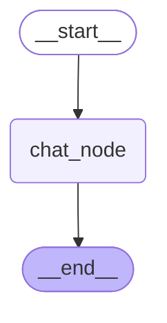

# Streaming + Persistent Chatbot (LangGraph, LangChain, Ollama, Streamlit)

## Overview
This project demonstrates a **fully local chatbot** that supports:

- **Streaming responses in the Streamlit UI**
- **Thread-level memory persistence using LangGraph checkpoints (`InMemorySaver`)**
- **LLM inference via Ollama (`llama3.1`)**
- **Message handling using LangChain abstractions**
- **Offline execution with no external API dependency**

The backend manages conversation state, while the frontend now streams tokens/chunks to the user using `st.write_stream()` with LangGraph’s `.stream()` method.

---

## What is Streaming Here?
Streaming means the model does **not return the full response at once**.  
Instead, it sends the output in small chunks (token by token or message fragments), which are rendered in the UI progressively.

In this project:
1. User sends input from Streamlit chat.
2. The message is appended to `session_state.message_history`.
3. LangGraph restores the previous checkpoint using the same `thread_id`.
4. `chat_node()` calls the LLM in the graph.
5. Streamlit consumes the response using `chatbot.stream()` and displays chunks live via `st.write_stream()`.

> This allows the user to see the model typing in real time, while LangGraph still maintains state persistence in memory.

---
## UI Preview

---

## Architecture Diagram

---
## Sequence Flow
```mermaid
sequenceDiagram
    participant UI as Streamlit UI
    participant LG as LangGraph
    participant LLM as Ollama Model
    participant CP as Checkpoint Store

    UI->>LG: User message
    LG->>CP: Restore latest checkpoint (thread-1)
    CP-->>LG: Return stored state
    LG->>LLM: LLM.invoke(full messages)
    LLM-->>LG: Response chunks
    LG-->>UI: Stream chunks progressively
    LG->>CP: Save updated checkpoint

