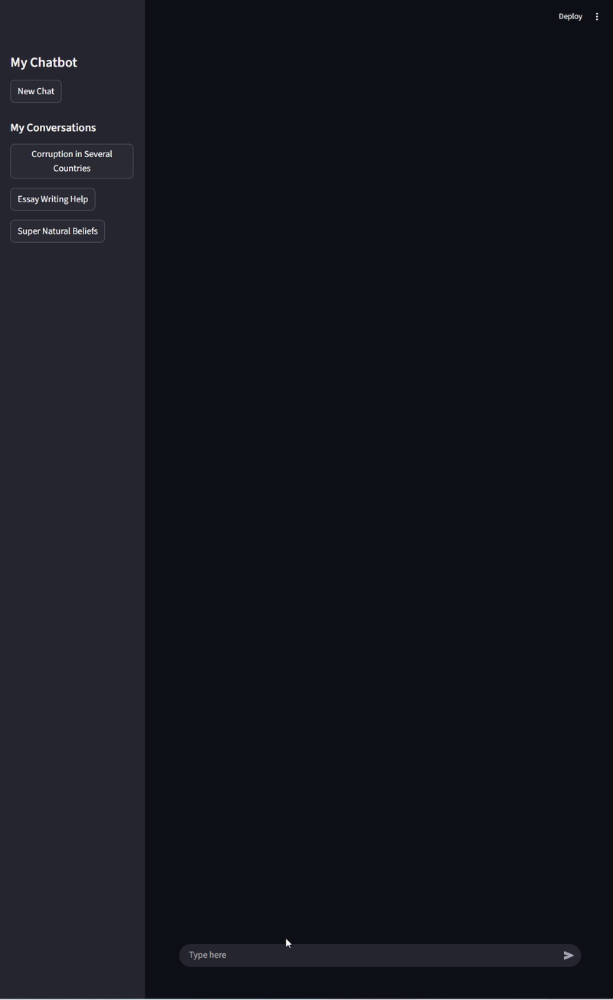
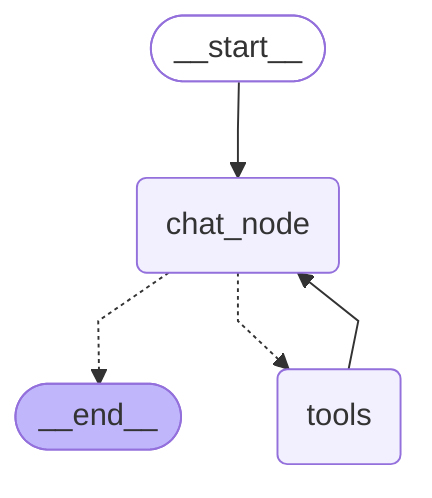
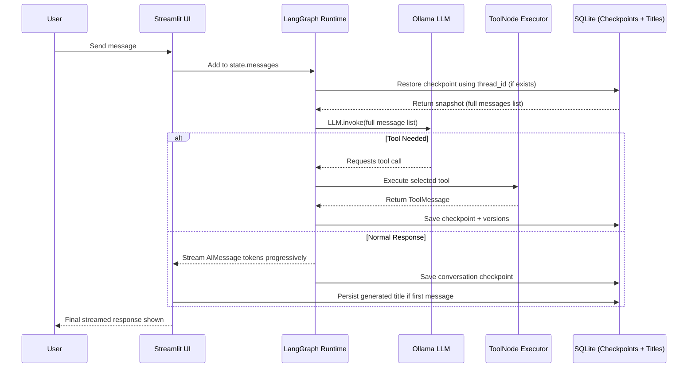

# Streaming, Tool-Enabled & Crash-Resilient Offline Chatbot

## Overview
This is a **fully offline, persistent, tool-enabled chatbot prototype** built for learning and future reference.  
It demonstrates a real-world conversational AI pattern using:

- **Ollama LLM (`llama3.1`)** for local inference  
- **LangChain message abstraction** (`HumanMessage`, `AIMessage`, `ToolMessage`)
- **LangGraph `StateGraph` orchestration** for structured state transitions
- **SQLite checkpoint persistence (`SqliteSaver`)** so chat history **survives crashes and server restarts**
- **Streamlit UI streaming** to render assistant tokens in real-time
- **Multiple conversation threads** with ChatGPT-like sidebar switching
- **Tool-calling support** (search, calculator, stock price, weather)

> **Key highlight:**  
> **Even after a server or app restart or crash, previous conversations are restored from SQLite and shown in the UI exactly as they were.**  
> This is achieved by LangGraph checkpoints stored on disk using a persistent `thread_id` as the memory key.

---
## UI Preview

---
## Tech Stack

| Layer | Technology |
|---|---|
| Model Inference | Ollama `llama3.1` (local LLM) |
| Orchestration | LangGraph `StateGraph` |
| Memory Persistence | `langgraph.checkpoint.sqlite.SqliteSaver` |
| Message Schema | `langchain_core.messages` |
| UI Framework | Streamlit |
| Tooling | DuckDuckGo Search, Arithmetic Calculator, AlphaVantage Stock API, WeatherStack API |
| Database | SQLite (local file storage) |

---

## Tools Included

### 1. **DuckDuckGo Search**
- Used for real-time web search without tracking or storing PII
- Invoked when the LLM needs external information
- Supports query enrichment for general knowledge, current events, or lookup questions

### 2. **Calculator Tool**
Supports 4 arithmetic operations for any 2 numbers:
- `add` → addition
- `sub` → subtraction
- `mul` → multiplication
- `div` → division (with zero-check guard)

Returns structured JSON:

```json
{
  "first_num": 10,
  "second_num": 5,
  "operation": "mul",
  "result": 50
}
```

### 3. Alpha Vantage Stock Price Tool
- Fetches latest stock market price using the GLOBAL_QUOTE endpoint
- Runs only when the model explicitly triggers a tool call
- Accepts standard ticker symbols like:
`AAPL, TSLA, MSFT, GOOG, AMZN`
- Response is raw API JSON returned by AlphaVantage
- Helps answer questions like:

  - “Latest stock price for TSLA?”
  - “What is the current price of AAPL?”
  - “Stock value for MSFT today?”

Example returned API structure:
```json
{
  "Global Quote": {
      "01. symbol": "AAPL",
      "05. price": "255.45",
      "10. change percent": "0.34%"
  }
}
```
### 4. Weather Fetch (WeatherStack API)
- Accepts city name (e.g., London, Tokyo, Mumbai)
- Returns current weather JSON
- Does not store weather API key in memory or expose it to UI
- Helps answer climate or temperature related questions locally

---

## Memory & Persistence Design
### Thread-Scoped Checkpoints
- Each conversation runs under a unique thread_id (string UUID)
- LangGraph persists the entire messages list into SQLite checkpoints
- On reload, chatbot.get_state() restores the full conversation
- Because thread_id is reused across inference turns, the bot can:
  - Recall previous messages
  - Maintain continuity
  - Survive crashes or server restarts
  - Rehydrate UI history on boot

### Title Persistence (Stored Separately)
- Titles are generated by the LLM in the frontend
- Stored in a separate table: thread_title(thread_id, title)
- UUID is the internal key, title is the human-friendly label
- On restart, sidebar buttons hydrate from DB-stored titles, mimicking ChatGPT UX

---
## Mermaid

## Sequence Diagram
