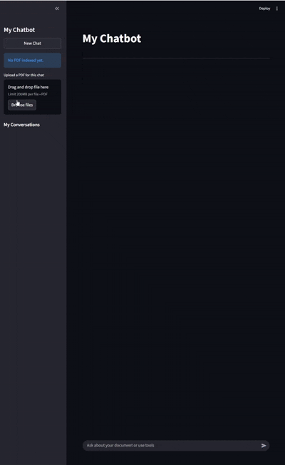
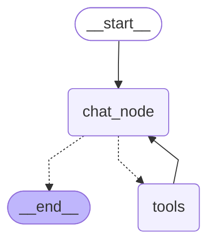
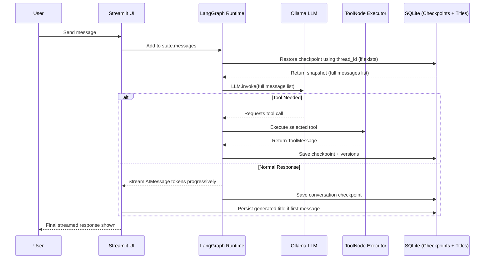

# Streaming, Tool-Enabled & Crash-Resilient Offline Chatbot with RAG Support

## Project Goal
A fully offline conversational AI system built for learning and future recollection. The system demonstrates:

- Local LLM inference using **Ollama (`llama3.1`)**
- **Streaming token responses** in Streamlit UI
- **Crash-resilient memory** using SQLite checkpoints via **LangGraph `SqliteSaver`**
- **Thread-scoped conversation persistence** (multi-session chat switching)
- **LLM-generated conversation titles** persisted in SQLite
- **Tool calling orchestration** using LangChain + LangGraph
- **Retrieval-Augmented Generation (RAG)** on user-uploaded PDFs using FAISS embeddings
- Conversation recall exactly like ChatGPT: bot remembers names, context, and tool interactions inside each thread
- **Most important highlight**:  
  **All conversations survive server/app restart, crash, or reboot**, because state is persisted to disk (SQLite), not RAM.

---
## UI Preview


---

## Why This Project Matters
Typical chatbot prototypes store chat history in memory. That means:

- If the server restarts → history is lost
- If the app crashes → history is lost
- If the container reboots → history is lost

This chatbot avoids those issues by using:

1. **LangGraph checkpoints stored in SQLite** → restores full conversation state every time
2. **Thread-scoped memory using UUID (string) keys** → enables multi-session switching
3. **Separate metadata table for chat titles** → ensures UI names persist independently of graph state
4. **FAISS vector store per thread** → enables document-based question answering

So:

- The UUID remains the **internal persistence key**
- The UI displays **LLM-generated clean chat titles**
- The entire chat state (all messages) is **replayed to the model on each turn**, so recall works
- Even after restart/crash → UI rehydrates thread titles and messages from DB

---

## Core Concepts Used

### 1. **Ollama LLM (`llama3.1`)**
- Runs locally
- No external API keys required for chat inference
- Used for both answering questions and generating conversation titles

### 2. **LangChain Message Objects**
Instead of raw text, conversations are represented as:

- `HumanMessage` → user messages
- `AIMessage` → model responses
- `ToolMessage` → tool execution responses

This ensures structured role separation and graph-compatible state reduction.

---

### 3. **LangGraph `StateGraph` Orchestration**
The chatbot logic is modeled as a state transition graph:


- `chat_node()` receives full message list from checkpoints
- The LLM may either answer directly or request a tool call
- Conditional routing (`tools_condition`) ensures tool calls go to the correct executor node

---

### 4. **SQLite Persistence (`SqliteSaver` Checkpointer)**
- Stores conversation checkpoints to disk
- Memory is **crash-proof and restart-proof**
- Restores full conversation using:

```python
chatbot.get_state({"configurable": {"thread_id": <uuid-string>}})
```
---
### 5. Conversation Naming (Chat Titles)

Since chat titles are generated in the **frontend using the LLM**, they are persisted in a **separate SQLite metadata table** so they survive crashes and restarts.

Example of stored records:

| thread_id | title |
|---|---|
| `6d87f343-6357-42a2-8ced-26d193b9eced` | London Weather |
| `1a44c2d1-…` | Stock Lookup |
| `8c33a7f9-…` | Interview Prep |

- `thread_id` is the **internal memory key** (string UUID)
- `title` is the **human-friendly conversation label**
- This separation avoids Streamlit widget duplication and enables ChatGPT-style UX naming

---

### 6. Tool Calling Support

The chatbot supports tool invocation using **LangChain tool binding** and **LangGraph conditional routing**.  
The following tools are integrated:

#### **1. DuckDuckGo Search**
- Used for real-time information lookup
- Ideal for general knowledge, factual queries, or news lookups
- Search output is **not stored permanently** unless part of a LangGraph checkpoint

#### **2. Calculator**
Supports basic arithmetic on any two numbers:

| Operation Key | Meaning |
|---|---|
| `add` | Addition |
| `sub` | Subtraction |
| `mul` | Multiplication |
| `div` | Division |

- Returns structured JSON result
- Prevents division by zero

Example response:
```json
{
  "first_num": 12,
  "second_num": 10,
  "operation": "mul",
  "result": 120
}
```
---
### 3. Alpha Vantage Stock Price
- Fetches latest stock price using `GLOBAL_QUOTE`
- Accepts ticker symbols like: `AAPL`, `TSLA`, `MSFT`, `AMZN`
- Returns raw JSON from the AlphaVantage API
- Invoked only when the LLM explicitly requests a tool call
- Used for financial market lookups inside a chat thread

---

### 4. WeatherStack Weather Lookup
- Retrieves **current weather conditions** for a given city
- Accepts city names like: `London`, `Tokyo`, `Mumbai`, `New York`
- Returns JSON weather data from WeatherStack API
- Supports tool-based answers for temperature, humidity, wind speed, and climate queries
- Responses can be checkpointed if part of the conversation flow

---

### 5. RAG PDF Retriever (FAISS)
- Enables users to upload a PDF document for question answering
- Converts PDF into semantic search chunks using `RecursiveCharacterTextSplitter`
- Generates embeddings using `nomic-embed-text`
- Stores vectors in a **thread-scoped FAISS index**, ensuring isolation across chat sessions
- Supports document-based question answering even after:
  - App crash
  - Server restart
  - System reboot
- Semantic search retrieval is executed using:

```python
retriever.invoke(query)
```
---
## Mermaid

## Sequence Diagram
