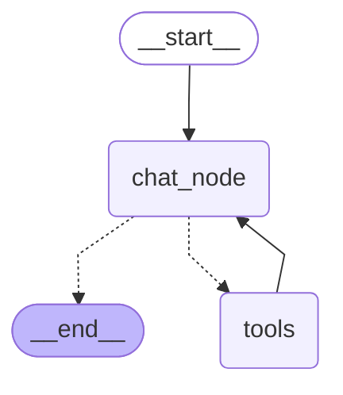
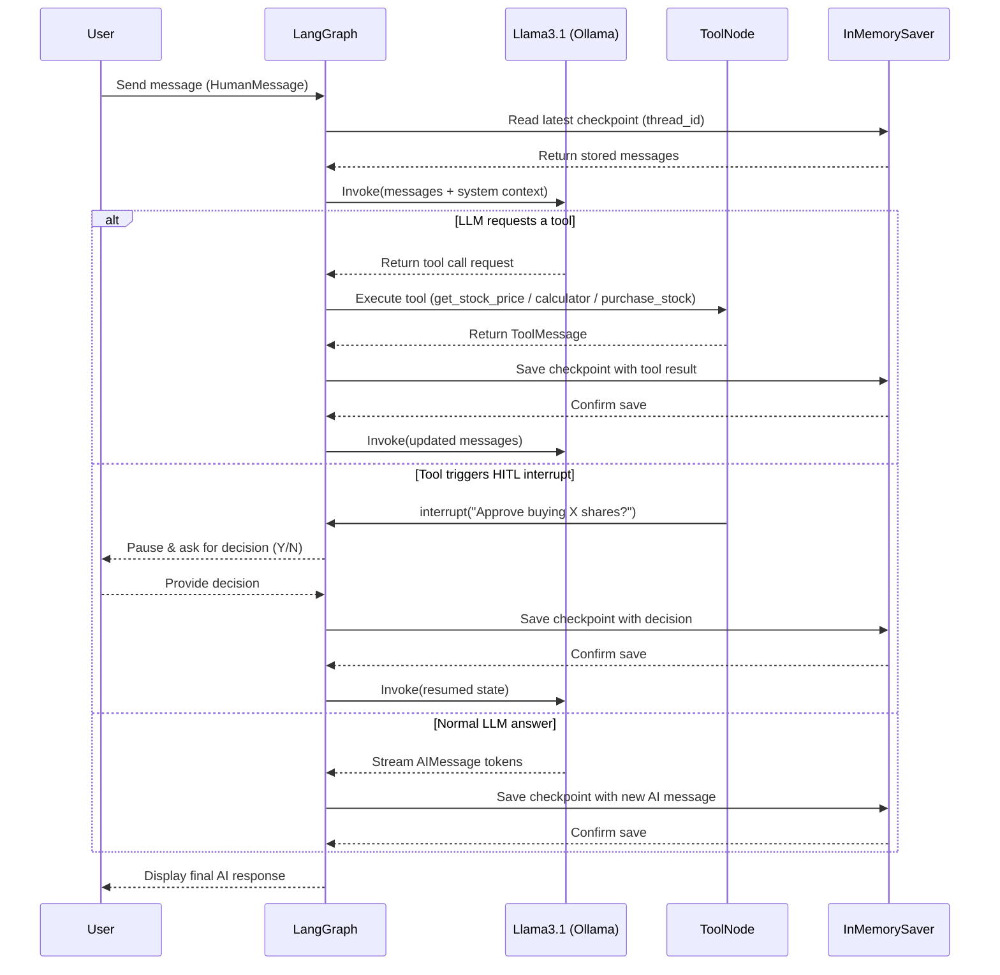

# Offline Stateful Chatbot with Tool Calling & Human-In-The-Loop

## Code Review & Component Explanation

### Libraries Used
- `langgraph.graph.StateGraph` → Builds a state-based execution graph for agent orchestration.
- `START`, `END` → Special constants defining graph entry and exit points.
- `add_messages` → Annotation reducer that safely merges message history into state.
- `langgraph.types.interrupt` → Enables Human-In-The-Loop (HITL) pauses during execution.
- `langgraph.types.Command` → Allows resuming an interrupted graph.
- `langgraph.checkpoint.memory.InMemorySaver` → Stores conversation checkpoints in RAM.
- `langgraph.prebuilt.ToolNode` → Prebuilt LangGraph node for executing tools.
- `tools_condition` → Conditional edge router that decides if a tool should run.
- `langchain_ollama.ChatOllama` → Local LLM inference using Ollama.
- `langchain_core.messages` → Chat messages represented as structured objects:
  - `HumanMessage` → User messages
  - `AIMessage` → Model responses
  - `ToolMessage` → Tool execution outputs
- `langchain_classic.tools.tool` → Decorator for defining tool functions compatible with LangChain/LangGraph.
- `requests` → HTTP client used inside tools for external API calls.

---
### Mermaid Diagram

---

### Tools Implemented

#### `get_stock_price(symbol)`
- Calls **Alpha Vantage `GLOBAL_QUOTE` API** to fetch live stock price data.
- Accepts ticker symbols like `AAPL`, `TSLA`, etc.
- Returns raw JSON from API.
- Bound to the LLM so the model can choose to invoke it.

#### `purchase_stock(symbol, quantity)`
- Simulates stock purchase.
- Uses `interrupt()` to pause execution and ask for human approval.
- Checks for decision string and proceeds only if input is `"y"`.
- Returns success or cancelled JSON based on human decision.

---

### CLI Chat Loop Behavior
- The chatbot runs in an infinite terminal loop using `while True` and waits for user input via `input()`.
- Each user message is wrapped into a `HumanMessage` object and passed into the LangGraph workflow state.
- The state graph executes using `workflow.invoke()` with a `thread_id` inside `config`, enabling thread-scoped checkpoint memory.

### Human-In-The-Loop Interrupts
- Tools such as `purchase_stock()` may call `interrupt()`, which pauses the graph execution.
- Interrupt signals are returned in `__interrupt__` and detected using `result.get("__interrupt__", [])`.
- When interrupted, the system prints an approval prompt and waits for a human decision (`y/n`) from the terminal.

### Resuming Execution
- The graph resumes from the paused tool node using `workflow.invoke(Command(resume=decision))` with the same `thread_id` config.
- The decision is used only to continue the workflow and is not directly fed into the LLM.

### Assistant Response Rendering
- After execution (normal or resumed), the final assistant message is always the last `AIMessage` in `state["messages"]`.
- The bot prints this response to the user using `print(last_msg.content)`.

This architecture ensures structured state merging, thread-scoped memory recall, and controlled execution for sensitive tool actions.

## Sequence Diagram

